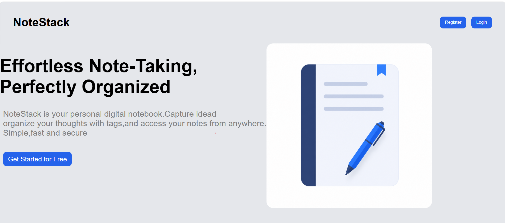
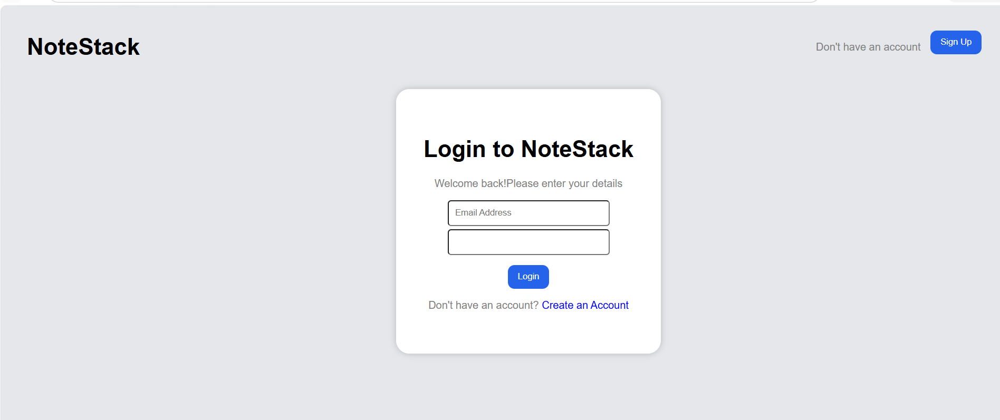
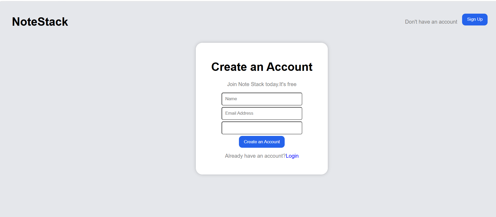
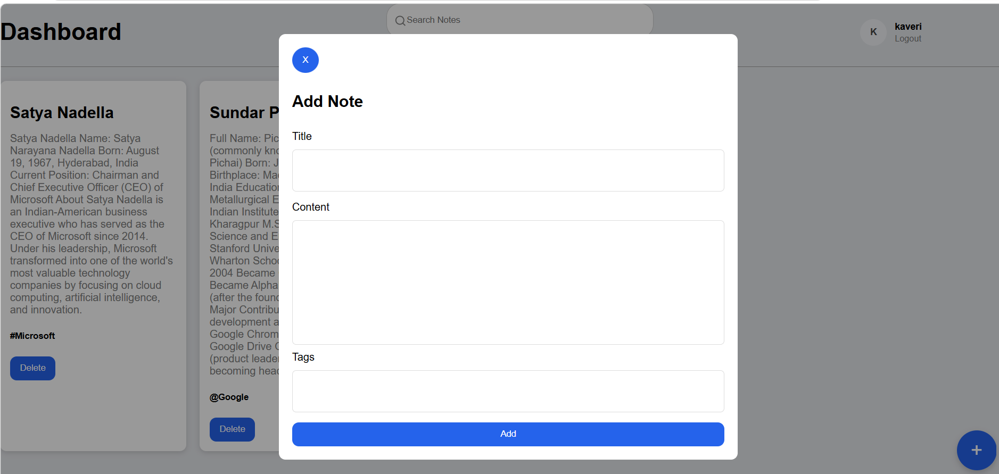
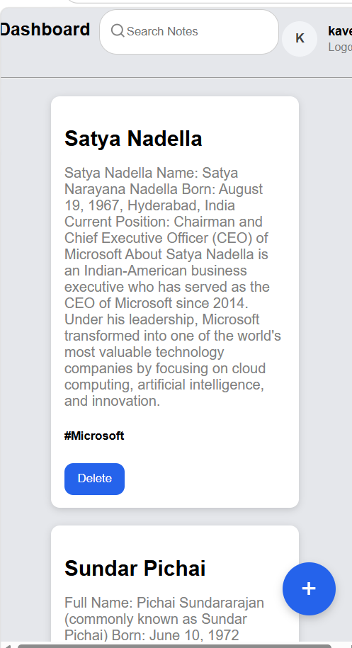

# NoteStack 📝

**Effortless Note-Taking, Perfectly Organized**

---

NoteStack is a modern, full-stack note-taking application built to help users capture, organize, and manage their notes efficiently. It provides a clean, responsive interface with secure authentication and powerful note management features.

Built with the **MERN Stack (MongoDB, Express.js, React.js, Node.js)** and styled using ** CSS** for a modern user experience.

---

## ✨ Features

- 🔐 **JWT Authentication** – Secure user registration and login.
- 📝 **Create, Read, Update & Delete Notes** – Easily manage your notes.
- 🏷️ **Tags Support** – Organize notes with custom tags.
- 🔍 **Search Functionality** – Search notes instantly by title or content.
- 📱 **Responsive Design** – Works seamlessly on desktop, tablet, and mobile.
- 🌐 **Protected Routes** – Only authenticated users can access their dashboard.
- ⚡ **Fast Performance** – Built with React + Vite for a smooth experience.
- 🎨 **Modern UI** – Clean and attractive interface using Tailwind CSS.

---

# 🛠️ Tech Stack

## Frontend

- React.js
- Vite
-  CSS
- React Router DOM

## Backend

- Node.js
- Express.js
- MongoDB
- Mongoose
- JSON Web Token (JWT)
- Bcrypt.js
- CORS

---

## 📂 Project Structure

```text
NoteStack
│
├── backend
│   ├── models
│   ├── routes
│   ├── app.js
│   └── package.json
│
├── frontend
│   ├── public
│   ├── src
│   ├── index.html
│   ├── package.json
│   └── vite.config.js
│
├── .gitignore
└── README.md
```

---

# ⚙️ Installation & Setup

## 1. Clone the Repository

```bash
git clone https://github.com/yourusername/NoteStack.git

cd NoteStack
```

---

## 2. Backend Setup

```bash
cd backend
npm install
```

Create a `.env` file inside the backend folder.

```env
MONGODB_URI=your_mongodb_connection_string
JWT_SECRET_KEY=your_secret_key
PORT=3000
```

Run the backend.

```bash
npm start
```

---

## 3. Frontend Setup

```bash
cd frontend/

npm install

npm run dev

---


## 📸 Screenshots

### 🏠 Home Page



### 🔐 Login Page



### 📝 Register Page



### 📋 Dashboard



### 📱 Responsive View



---

# 👨‍💻 Madhavi Meesala

- GitHub: https://github.com/madhavi-1231
- LinkedIn: www.linkedin.com/in/madhavi-meesala-193445413
- Email: madhavimeesala09@gmail.com

---


